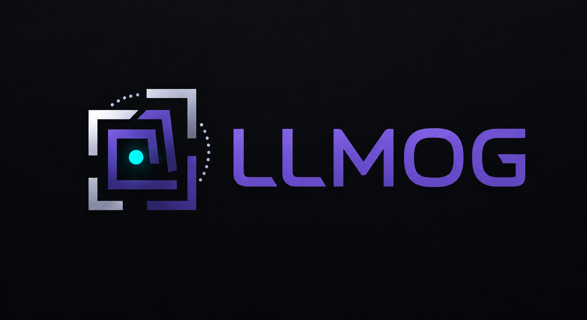

# 🔍 llmog (LLM Object Detection) 

**An Library for object detection tasks using LLMs.**



This project implements an iterative **Detector-Judge pipeline**: a VLM "detector" agent proposes bounding boxes, a VLM "judge" agent critiques them against the original image, and the loop repeats with structured feedback until the annotations meet a quality threshold or the round limit is reached.

It ships **two complementary workflows** behind a single unified CLI:

| `--task` | What it does | Typical input |
|----------|---------------|----------------|
| `free_detection` | Runs the detector→judge loop on explicitly supplied `--image` paths and dumps per-image annotations + history. | One or more `--image` paths + `--categories` |
| `auto_label` | Walks a YOLO-format dataset folder (`--train_image`/`--train_label` + `data.yaml`), relabels each binary defect/no-defect box into a multi-class label using a VLM classify-this-crop call, and persists an updated `data.yaml`. | `--train_image`, `--train_label`, `--yaml_path`, `--model` |

---

## Table of Contents

- [Key Features](#-key-features)
- [Setup & Installation](#-setup--installation)
- [Usage](#️-usage)
  - [1. Launching the Web GUI](#1-launching-the-web-gui)
  - [2. Free-Detection CLI](#2-free-detection-cli---task-free_detection)
  - [3. Auto-Labeling CLI](#3-auto-labeling-cli---task-auto_label)
  - [4. YAML Config + CLI Overrides](#4-yaml-config--cli-overrides)
- [Output Structure](#-output-structure)
- [Technology Stack](#️-technology-stack)

---

## 🌟 Key Features

**Core pipeline**
- **Iterative Refinement Loop** — enhances detection accuracy by feeding visual and text-based critiques back to the detector across multiple rounds.
- **Unified CLI** — a single entry point (`uv run llmog --task ...`) routes to either workflow; the legacy `detection-cli` and `auto-annotation` aliases are kept as shortcuts.
- **YAML Config + CLI Precedence** — every flag can live in a YAML file loaded via `--config`. Explicit CLI flags always win over YAML, which wins over framework defaults.
- **Batch YOLO Auto-Labeling** — `auto_label` mode walks an existing defect/no-defect dataset, asks the VLM to classify each cropped box, accumulates a `class_map`, and updates `data.yaml` in place — with resumable checkpoints and batched I/O.
- **Visual Annotations & Grids** — automatically overlays a customizable 0–1000 coordinate grid on images to aid the VLM's spatial reasoning, and draws lime-green bounding boxes with legible text labels for final detections.
- **Robust File Persistence** — saves the best annotated image, raw JSON detections, and complete round-by-round history for every processed image.

**Advanced image preprocessing & augmentation**
- **Dynamic Resolution Tuning** — custom upscaling target for the short edge, with optional letterbox padding to preserve aspect ratio on square inputs.
- **Contrast & Color Enhancements** — LAB color-space CLAHE, global autocontrast, gamma correction (0.5–2.0), and Gray World white balance correction.
- **Noise Filtering & Sharpening** — bilateral or Non-Local Means (NLM) denoising with edge preservation, plus unsharp mask sharpening.
- **Tiling Engine for Small Objects** — slices high-resolution inputs into overlapping sub-patches, runs sequential detection on each tile, and merges overlapping detections with Non-Maximum Suppression (NMS).
- **Crop & Verify Validation** — runs a second-pass confirmation on cropped candidate coordinates with context padding to reduce hallucinated detections.
- **Set-of-Mark (SoM) Prompting** — classic CV contour detection overlays numbered candidate regions onto the image, turning the spatial regression task into a simpler classification/selection task.
- **Fully Customizable Grid Overlays** — adjustable style (standard, transparent, fine, none), step size, line thickness, font size, and custom colors (line, text, and text-backing box — CSS name or hex).
- **VLM Processor Pixel Bounds** — manually configure `min_pixels` and `max_pixels` request parameters (passed via the API request's `extra_body`) to tune vision encoder resolution and prevent OOMs on backends like vLLM / Qwen-VL.

**Server lifecycle managers (`src/servers/`)**
- 🦙 **`LlamaServerManager`** — manage local `llama-server` background processes, configure ports, context sizes (`--ctx-size`), KV cache quantization (`--cache-type-k`/`--cache-type-v`), parallel request slots, draft models, flash attention, and reasoning toggles.
- ⚡ **`VllmServerManager`** — launch and control local `vLLM` instances with tensor/pipeline parallelism, custom dtypes, prefix caching, and chunked prefill options.

**Gradio web interface**
- 🦙 **Server Management** — start, stop, and monitor multiple local `llama-server` / `vLLM` instances directly within the GUI.
- ⚙️ **Detection Settings** — customize target categories, category definitions, prompt templates, per-role model/server routing, and sampling parameters.
- 🧪 **Batch Test** — upload multiple images, run them sequentially, view live per-round annotated results, and download all outputs as a `.zip` archive.
- 🖼️ **Interactive Preprocessing & Custom Grids** — tweak all resolution scaling, filters, tiling options, grid colors, text sizes, and pixel bounds directly through visual controls.

---

## 🚀 Setup & Installation

**Requirements:** Python 3.12+, [uv](https://github.com/astral-sh/uv), and (optionally) a CUDA-capable GPU for local `llama.cpp` inference.

1. **Clone the repository**:
   ```bash
   git clone https://github.com/mohamed-em2m/llm-object-grounding.git
   cd llm-object-grounding
   ```
2. **Install dependencies**:
   ```bash
   ./scripts/install_llama_cpp.sh   # Linux only; builds llama.cpp with CUDA
   uv sync
   ```

---

## 🖥️ Usage

There is one unified entry point — `llmog` — that dispatches by `--task`:

```bash
uv run llmog --task free_detection -i image.jpg -c "person, car, dog"
uv run llmog --task auto_label     --train_image imgs/ --train_label lbls/ \
    --yaml_path data.yaml --model local-model -o ./out
```

Both workflows also have shortcut aliases that pre-set the right `--task` for you:

```bash
uv run detection-cli -i image.jpg -c "person, car, dog"
uv run auto-annotation --train_image imgs/ --train_label lbls/ \
    --yaml_path data.yaml --model local-model -o ./out
```

> **Single source of truth**: every CLI flag is defined on `src/schemes/argument.py:PipelineConfig` (a pydantic v2 model). `src/main.py:build_parser` mirrors that model onto an `argparse.ArgumentParser`, and `parse_args()` overlays an optional `--config <yaml>` file before constructing the validated `PipelineConfig`. Both dashed (`--prep-tile-size`) and underscored (`--prep_tile_size`) forms are accepted.

### 1. Launching the Web GUI

To launch the interactive Gradio interface:

```bash
uv run detection-gui
```

Options:

| Flag | Description | Default |
|------|-------------|---------|
| `--host` | Host to bind the Gradio server to | `0.0.0.0` |
| `--port` | Port to run the server on | `7860` |
| `--share` | Create a public Gradio share link | off |
| `--no-queue` | Disable Gradio's request queue | off |

Example:

```bash
uv run detection-gui --port 7861 --share
```

### 2. Free-Detection CLI (`--task free_detection`)

Run the detector→judge pipeline on one or more images:

```bash
uv run llmog --task free_detection --image path/to/image.jpg --categories "person, car, dog"
```

#### Common options

| Flag | Description | Default |
|------|-------------|---------|
| `-i`, `--image` | Path to an input image (repeatable for batch processing) | — |
| `-c`, `--categories` | Comma-separated list of object categories to detect | `person, car, bicycle, dog, cat` |
| `-d`, `--definitions` | Optional category definitions to help the VLM distinguish similar categories | — |
| `--base_url` | OpenAI-compatible API base URL | `http://localhost:8080/v1` |
| `--detector_model` / `--judge_model` | Models to use for detection and judging | — |
| `--judge_url` | Separate base URL for the judge model | same as `--base_url` |
| `--max_rounds` | Max detector→judge iterations per image | `2` |
| `--score_threshold` | Quality score (0–10) to stop the loop early | `8` |
| `-o`, `--output_folder` (also `--output_dir`) | Output directory for results | `./detection_results` |
| `--no_plot` | Skip displaying the matplotlib preview window after completion | off |

#### Preprocessing pipeline options

| Flag | Description | Default |
|------|-------------|---------|
| `--prep_enabled` | Enable image preprocessing | off |
| `--prep_short_edge` | Target size for the short edge of the image | `1024` |
| `--prep_pad_square` | Pad preprocessed image to square with neutral gray | off |
| `--prep_contrast_method` | Contrast enhancement method (`none`, `clahe`, `autocontrast`) | `none` |
| `--prep_gamma` | Gamma correction factor | `1.0` |
| `--prep_denoise_method` | Denoising method (`none`, `bilateral`, `nlm`) | `none` |
| `--prep_sharpen` | Apply unsharp mask sharpening | off |
| `--prep_white_balance` | Apply white balance correction | off |
| `--prep_som_enabled` | Enable Set-of-Mark visual prompting overlay | off |
| `--prep_tiling_enabled` | Enable image tiling for small object detection | off |
| `--prep_tile_size` | Tile size in pixels | `512` |
| `--prep_tile_overlap` | Overlap ratio between tiles | `0.2` |
| `--prep_crop_verify_enabled` | Enable multi-pass Crop & Verify validation pipeline | off |
| `--prep_crop_padding` | Context padding ratio for cropped patches | `0.15` |

#### Custom grid & VLM pixel bounds options

| Flag | Description | Default |
|------|-------------|---------|
| `--prep_grid_style` | Visual grid overlay style (`standard`, `transparent`, `fine`, `none`) | `standard` |
| `--prep_grid_step` | Grid line separation on a 0–1000 scale | `100` |
| `--prep_grid_line_width` | Grid line thickness in pixels | `1` |
| `--prep_grid_font_size` | Grid text label font size (`0` = auto) | `0` |
| `--prep_grid_line_color` | Grid line color — CSS name or hex | `red` |
| `--prep_grid_text_color` | Grid text label color — CSS name or hex | `white` |
| `--prep_grid_backing_color` | Grid text label backing box color — CSS name, hex, or `'none'` | `black` |
| `--prep_send_pixel_bounds` | Send `min_pixels`/`max_pixels` in the OpenAI-compatible API request payload | off |
| `--prep_min_pixels` | VLM `min_pixels` parameter passed to the model processor | `200704` |
| `--prep_max_pixels` | VLM `max_pixels` parameter passed to the model processor | `4194304` |

Example running CLAHE, NMS tiling, custom blue grid coordinates, and custom Qwen-VL pixel bounds:

```bash
uv run llmog --task free_detection \
  -i industrial_part.jpg \
  -c "crack, scratch, dent" \
  --prep_enabled \
  --prep_contrast_method clahe \
  --prep_tiling_enabled \
  --prep_tile_size 512 \
  --prep_tile_overlap 0.25 \
  --prep_grid_line_color "blue" \
  --prep_grid_step 50 \
  --prep_send_pixel_bounds \
  --prep_min_pixels 200704 \
  --prep_max_pixels 2097152 \
  -o ./inspection_results
```

### 3. Auto-Labeling CLI (`--task auto_label`)

Walk an existing YOLO-format dataset (binary defect/no-defect), re-classify each annotated crop with a VLM, accumulate a class map, and persist the updated `data.yaml`.

```bash
uv run llmog --task auto_label \
    --train_image imgs/ --train_label lbls/ \
    --yaml_path data.yaml \
    --model local-model \
    -o ./out
```

#### Auto-label-specific options

| Flag | Description | Default |
|------|-------------|---------|
| `--train_image` | Folder containing the training images (required) | — |
| `--train_label` | Folder containing the YOLO `.txt` label files (required) | — |
| `--yaml_path` | Path to the dataset's `data.yaml` (required) | — |
| `--init_class_map` | Initialize the class map from the YAML's `names` list | off |
| `--conf_threshold` | Confidence (1–5); boxes at or below this are also logged to a `*_low_confidence.json` for manual review | `2` |
| `--inplace_saving` | Write relabeled `.txt` files back over the originals | off (writes to `--output_folder`) |
| `--num_samples` | Only process this many images (sanity-check run) | — |
| `--shuffle` / `--seed` | Shuffle image order with a fixed seed | off |
| `--start_index` / `--end_index` | 0-based `[start, end)` slice of the image list — useful for splitting a large dataset across multiple runs/machines | — |
| `--batch_size` | Images per batch; each finished batch is checkpointed so resumed runs can skip it | `0` (disabled) |
| `--max_workers` | Thread-pool size for concurrent image processing (raise for remote APIs) | — |
| `--resume` | Legacy per-file resume (skip if output `.txt` already exists) | off |
| `--auto_resume` (default on) / `--no_auto_resume` | Resume from `<output_folder>/.checkpoint.json` after an interrupted run; pass `--no_auto_resume` to start fresh | on |

### 4. YAML Config + CLI Overrides

Any field on `PipelineConfig` can live in a YAML file loaded by `--config`.

```yaml
# pipeline.yaml
max_rounds: 5
score_threshold: 9
categories: "crack, scratch, dent"
output_folder: ./yaml_out
auto_resume: false
```

```bash
# YAML provides defaults; CLI flags override only what they explicitly set.
uv run llmog --task free_detection --config pipeline.yaml -i img.jpg --max_rounds 2
# → max_rounds == 2          (CLI won)
# → score_threshold == 9      (from YAML)
# → output_folder == ./yaml_out (from YAML)
# → auto_resume == False      (from YAML)
```

---

## 📁 Output Structure

### `free_detection` task

For every image processed, a dedicated subdirectory is created under `--output_folder`:

```
detection_results/
├── summary.json             # Per-image status, best round + score
└── [image_name]/
    ├── best_annotated.jpg    # Best annotated image with lime-green bounding boxes
    ├── best_detections.json  # Final parsed JSON detections
    └── history.json          # Complete round-by-round scores, detections, and feedback
```

### `auto_label` task

Relabeled `.txt` files (YOLO format with the discovered class IDs) plus a checkpoint and an updated `data.yaml`:

```
out/
├── labels/                # (when not using --inplace_saving)
│   ├── img_0001.txt
│   └── ...
├── .checkpoint.json       # Auto-resume state (only if --auto_resume is on)
└── data.yaml               # Updated copy with the discovered class_map
```

---

## 🛠️ Technology Stack

- **Core Logic**: Python 3.12+, Pillow (PIL) for image manipulation, OpenCV (`opencv-python`) for CLAHE/contour/bilateral processing, Matplotlib for rendering.
- **VLM Integrations**: OpenAI Python SDK, compatible with any OpenAI-style endpoint (`llama-server`, vLLM, Ollama, etc.), with support for custom payloads via `extra_body`.
- **Web UI**: Gradio.
- **Environment & Package Management**: `uv`, Setuptools.

---

*Repository: [mohamed-em2m/llmog — framework for testing LLMs on object grounding](https://github.com/mohamed-em2m/llm-object-grounding)*